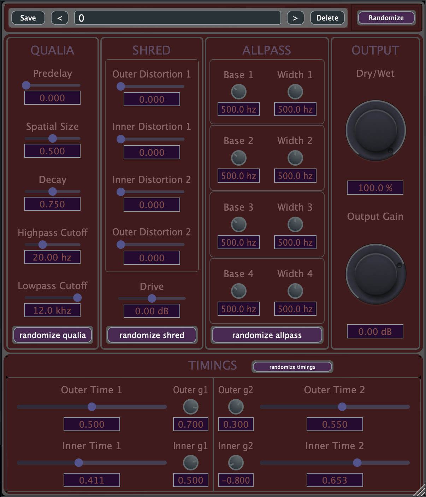

# shredverb

shredVerb: the reverb that shreds...



===============================================================

Short description:
shredVerb is a feedback delay network at its core. This is a common reverb design, but what makes shredVerb stand out is that it exploits this structure to attain very unique distortion effects. This is accomplished NOT by adding any distortion processing in the signal path! Instead, its allpass filters are frequency-modulated by the input signal and the reverb's feedback.

===============================================================


## Building shredVerb

### Prerequisites
Before building shredVerb, make sure you have:
- **JUCE Framework** installed in a known directory on your system
- **Foleys GUI Magic** installed in a known directory on your system
- **Projucer** (comes with JUCE installation)
- **Xcode** (macOS) or **Visual Studio** (Windows) for compilation

### Build Instructions

1. **Clone the repository:**
   ```bash
   git clone https://github.com/[your-username]/shredverb.git
   ```

2. **Navigate to the project directory:**
   ```bash
   cd shredverb
   ```

3. **Initialize and update git submodules:**
   ```bash
   git submodule update --init --recursive
   ```

4. **Open the project in Projucer:**
   ```bash
   open shredVerb/shredVerb.jucer
   ```
5. **Verify module dependencies:**
   - In Projucer, go to the **Modules** section
   - Ensure `foleys_gui_magic` appears in the module list
   - If it appears in red, the path needs to be corrected - update the path to point to your Foleys GUI Magic installation directory

6. **Generate IDE project:**
   - Click the appropriate IDE button in Projucer:
     - **"Save and Open in Xcode"** (macOS)
     - **"Save and Open in Visual Studio"** (Windows)

7. **Build the plugin:**
   - In your IDE (Xcode/Visual Studio), select **Release** build configuration
     - Note: Debug mode will enable the Foleys GUI Magic editor for GUI layout modification, which is not needed as an end user
   - Build the project using your IDE's build command

The compiled plugin will be placed in your system's plugin directory and ready to use in your DAW.

### Troubleshooting
- If Foleys GUI Magic shows up in red in the Modules section, verify the path points to the correct installation directory
- Make sure all git submodules are properly initialized if you encounter missing dependency errors
- Ensure your JUCE installation is up to date and compatible with the project


Plugin Controls:
--------------------------------------------------------------------
QUALIA:

Predelay sets an overall time delay between the dry signal and the response of all of the reverb processing.

Spatial Size is a global multiplier for the 4 reverb's delay times (which themselves are controlled in TIMINGS). 

Decay sets the amount of feedback within shredVerb. A decay of 0 means NO FEEDBACK, and you just get the 1st tap of the primary delays. A decay of 0.707106781186548 (rounded on display to 0.71) means INFINITE FEEDBACK–which may sound scary, but it is perfectly stable and will not just keep getting uncontrollably louder. Your incoming signal will both add and subtract from this infinite decay. This is great for ambient and drone music.

Highpass Cutoff sets the cutoff frequency for a highpass filter. A value between 20 and 400 Hz is recommended for most situations–this will clean up the sound but also change the character of the distortion as it feeds back (assuming Decay is non-zero).

Lowpass Cutoff sets the cutoff frequency for a lowpass filter. This will prevent the reverb and distortion from being too bright. A value between 2000 and 18000 is recommended in most cases.

-------------------------------------------------------------------------------------------------
DISTORTION:

Outer Distortion [1, 2] mostly affect the direct output's "distortion". While these have a more gnarly character, they do not affect the reverb AS IT FEEDS BACK. 

Inner Distortion [1, 2] mostly affect the "distortion" for the internal, feeding-back, decaying part of the reverb. They tend to be less blatant than the Outer, but since they work on feedback, their character builds up with each repetition. 

Drive sets how much signal is fed into the audio-rate modulation circuit of the allpass filters, while at the same time inversely driving the final output signal so maintain distortion-vs-gain balance. It is only a meaningful control if any of the previous distortions are non-zero. NOTE: you may find it strange that it seems to get LOUDER when you turn DOWN drive. This is part of the design (may be somewhat altered later)–but the idea is that, as the reverb decays, this balance is compensated perfectly.

-------------------------------------------------------------------------------------------------
ALLPASS:

Base [0, 1, 2, 3] sets the center frequency for the allpass filters. This changes the resonant structure of the reverb. When you have all the Distortion parameters at 0, this will be extremely subtle. 

Width [0, 1, 2, 3] sets the bandwidth for the allpass filters. This also changes the resonant structure of the reverb, but in a different way than Base. For instance, if you have a Width set very low, the filters may very clearly emphasize the specific frequency set on the corresponding Base parameter. When you have all the Distortion parameters at 0, this will be very subtle. 

-------------------------------------------------------------------------------------------------
DELAYS:

Outer [1, 2] sets the relationships between the direct delay taps. Note that these are ultimately multiplied by the Spatial Size parameter. 

Inner [1, 2] sets the relationships between the internal, decaying (feeding-back) delay taps. Note that these are ultimately multiplied by the Spatial Size parameter. 

g (Outer [1, 2], Inner [1, 2]): sets how diffused the given delay is.

-------------------------------------------------------------------------------------------------
OUTPUT:

Dry/Wet sets the mix between the dry (unprocessed) signal and wet (processed) signal.

Output Gain sets the amount of amplification for the wet signal. 

~~~~~~~~~~~~~~~~~~~~~~~~~~~~~~~~~~~~~~~~~~~~~~~~~~~~~~~~~~~~~~~

Known TODO list:
add unit displays
improve highpass filter
de-zipper some parameters
asymmetrical slew for 'drive' to avoid sudden volume boost with lower drive
improve character for param changes in timing/space/predelay to avoid rapid pitch shifts with small changes 
